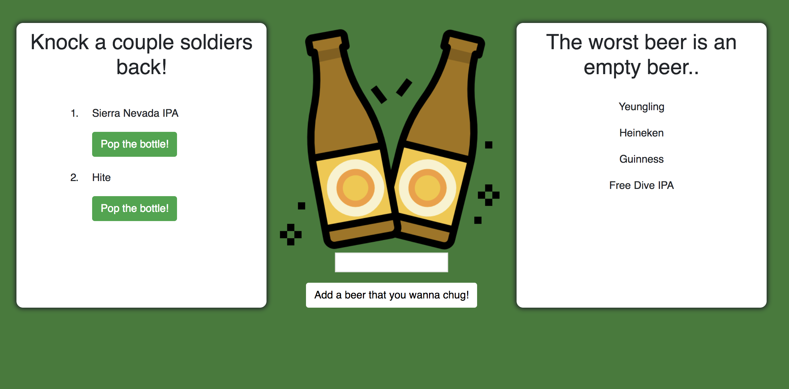

# Beer!

This repo houses the directories and files for my answer for homework 14. The repo is named burger, and everything inside of the files including variable names and database tables relate to burgers, but the content on the front-end is beer themed because beer is awesome.

Beer! is a full-stack webapp. When the page loads, the user sees a list of beers that have not yet been drank, a list of beers that have been drank, and an input field to add a new beer to drink. When the user clicks the "Pop the bottle!" button, the webapp communicates with the database and changes the status of the beer to being empty, causing it to render to the other div. When the user inputs a new beer, it is added into the database and given a default drink status of full, making it available for the user to click the "Pop the bottle!" button and drink the beer.

Technologies utilized in the making of Beer! include Express, Handlebars, Mysql, Sequel Pro, Node.js, and various other npm packages.